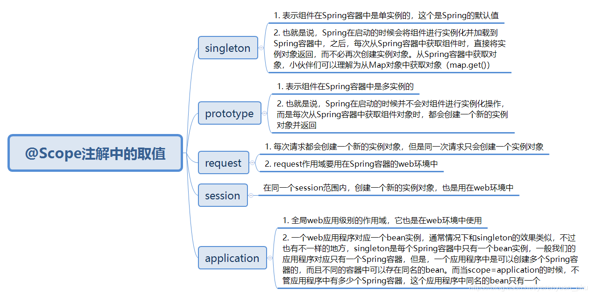

# Spring 注解

根据 [link](https://liayun.blog.csdn.net/article/details/115053350) 的学习记录

- 基于 spring 5.3.15

## 1. 思维导图

<details><summary>思维导图</summary>
<p>


</p>
</details>

## 2. Scope

<details><summary>Scope</summary>



</details>

## 3. life cycle

bean 的生命周期

容器启动 ->

### 总结: spring 中的 *Aware 接口及对应的功能

| Aware interface                  | Method to override                                           | Purpose                                                      |
| -------------------------------- | ------------------------------------------------------------ | ------------------------------------------------------------ |
| `ApplicationContextAware`        | void `setApplicationContext` (ApplicationContext applicationContext) throws BeansException; | Interface to be implemented by any object that wishes to be notified of the `ApplicationContext` that it runs in. |
| `ApplicationEventPublisherAware` | void `setApplicationEventPublisher` (ApplicationEventPublisher applicationEventPublisher); | Set the `ApplicationEventPublisher` that this object runs in. |
| `BeanClassLoaderAware`           | void `setBeanClassLoader` (ClassLoader classLoader);         | Callback that supplies the bean class loader to a bean instance. |
| `BeanFactoryAware`               | void `setBeanFactory` (BeanFactory beanFactory) throws BeansException; | Callback that supplies the owning factory to a bean instance. |
| `BeanNameAware`                  | void `setBeanName`(String name);                             | Set the name of the bean in the bean factory that created this bean. |
| `BootstrapContextAware`          | void `setBootstrapContext` (BootstrapContext bootstrapContext); | Set the BootstrapContext that this object runs in.           |
| `LoadTimeWeaverAware`            | void `setLoadTimeWeaver` (LoadTimeWeaver loadTimeWeaver);    | Set the LoadTimeWeaver of this object’s containing ApplicationContext. |
| `MessageSourceAware`             | void `setMessageSource` (MessageSource messageSource);       | Set the MessageSource that this object runs in.              |
| `NotificationPublisherAware`     | void `setNotificationPublisher` (NotificationPublisher notificationPublisher); | Set the NotificationPublisher instance for the current managed resource instance. |
| `PortletConfigAware`             | void `setPortletConfig` (PortletConfig portletConfig);       | Set the PortletConfig this object runs in.                   |
| `PortletContextAware`            | void `setPortletContext` (PortletContext portletContext);    | Set the PortletContext that this object runs in.             |
| `ResourceLoaderAware`            | void `setResourceLoader` (ResourceLoader resourceLoader);    | Set the ResourceLoader that this object runs in.             |
| `ServletConfigAware`             | void `setServletConfig` (ServletConfig servletConfig);       | Set the ServletConfig that this object runs in.              |
| `ServletContextAware`            | void `setServletContext` (ServletContext servletContext);    | Set the ServletContext that this object runs in.             |

> [参考 sring-bean-life-cycle]( https://howtodoinjava.com/spring-core/s)

```java
// 1.容器启动
AnnotationConfigApplicationContext applicationContext = new AnnotationConfigApplicationContext(MainConfigOfLifeCycle.class);

// 2.
org.springframework.context.support.AbstractApplicationContext.refresh

// 3. 
org.springframework.context.support.AbstractApplicationContext.finishBeanFactoryInitialization

// 4. 
org.springframework.beans.factory.support.DefaultListableBeanFactory.preInstantiateSingletons

// 5. 
org.springframework.beans.factory.support.AbstractBeanFactory.getBean(java.lang.String)

// 6.
org.springframework.beans.factory.support.AbstractBeanFactory.doGetBean

// 7.
org.springframework.beans.factory.support.DefaultSingletonBeanRegistry.getSingleton(java.lang.String, org.springframework.beans.factory.ObjectFactory<?>)

// 8.
org.springframework.beans.factory.support.AbstractAutowireCapableBeanFactory.createBean(java.lang.String, org.springframework.beans.factory.support.RootBeanDefinition, java.lang.Object[])

// 9.
org.springframework.beans.factory.support.AbstractAutowireCapableBeanFactory.doCreateBean

// 10.
org.springframework.beans.factory.support.AbstractAutowireCapableBeanFactory.initializeBean(java.lang.String, java.lang.Object, org.springframework.beans.factory.support.RootBeanDefinition)

// 11.
org.springframework.beans.factory.support.AbstractAutowireCapableBeanFactory.applyBeanPostProcessorsBeforeInitialization
        
// 12. 执行初始化方法 initMethod
org.springframework.beans.factory.support.AbstractAutowireCapableBeanFactory.invokeInitMethods

// 13.
org.springframework.beans.factory.support.AbstractAutowireCapableBeanFactory.applyBeanPostProcessorsAfterInitialization

// 之后循环依赖检查 afterPropertiesSet 
```
