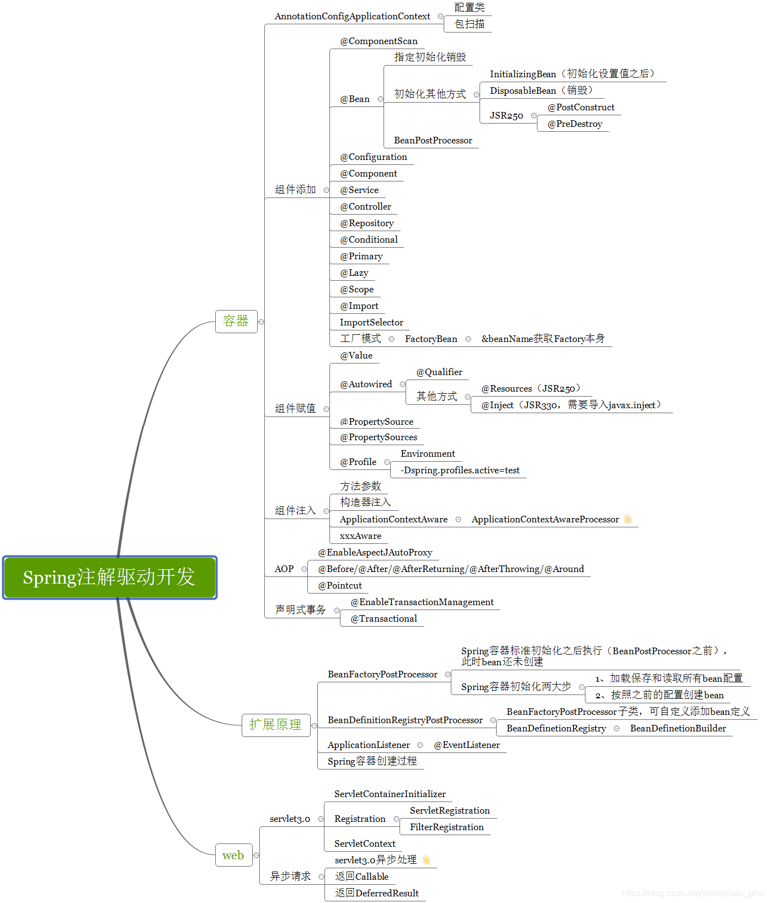

# Spring 注解

根据 [link](https://liayun.blog.csdn.net/article/details/115053350) 的学习记录

- 基于 spring 5.3.15

## 1. 思维导图

<details><summary>思维导图</summary>
<p>



</p>
</details>

## 2. Scope

<details><summary>Scope</summary>


</details>

## 3. life cycle

### doCreateBean

- 真正创建 bena 的地方: org.springframework.beans.factory.support.AbstractAutowireCapableBeanFactory.doCreateBean

```java
// https://juejin.cn/post/6844904065457979405
// AbstractAutowireCapableBeanFactory.java
protected Object doCreateBean(final String beanName, final RootBeanDefinition mbd, final @Nullable Object[] args)
    throws BeanCreationException {

    // 1. 实例化
    BeanWrapper instanceWrapper = null;
    if (instanceWrapper == null) {
        instanceWrapper = createBeanInstance(beanName, mbd, args);
    }
    
    Object exposedObject = bean;
    try {
        // 2. 属性赋值
        populateBean(beanName, mbd, instanceWrapper);
        // 3. 初始化
        exposedObject = initializeBean(beanName, exposedObject, mbd);
    }

    // 4. 销毁-注册回调接口
    try {
        registerDisposableBeanIfNecessary(beanName, bean, mbd);
    }

    return exposedObject;
}

```

### initializeBean

```java
// AbstractAutowireCapableBeanFactory.java
protected Object initializeBean(final String beanName, final Object bean, @Nullable RootBeanDefinition mbd) {
    // 3. 检查 Aware 相关接口并设置相关依赖
    if (System.getSecurityManager() != null) {
        AccessController.doPrivileged((PrivilegedAction<Object>) () -> {
            invokeAwareMethods(beanName, bean);
            return null;
        }, getAccessControlContext());
    }
    else {
        invokeAwareMethods(beanName, bean);
    }

    // 4. BeanPostProcessor 前置处理
    Object wrappedBean = bean;
    if (mbd == null || !mbd.isSynthetic()) {
        wrappedBean = applyBeanPostProcessorsBeforeInitialization(wrappedBean, beanName);
    }

    // 5. 若实现 InitializingBean 接口，调用 afterPropertiesSet() 方法
    // 6. 若配置自定义的 init-method方法，则执行
    try {
        invokeInitMethods(beanName, wrappedBean, mbd);
    }
    catch (Throwable ex) {
        throw new BeanCreationException(
            (mbd != null ? mbd.getResourceDescription() : null),
            beanName, "Invocation of init method failed", ex);
    }
    // 7. BeanPostProceesor 后置处理
    if (mbd == null || !mbd.isSynthetic()) {
        wrappedBean = applyBeanPostProcessorsAfterInitialization(wrappedBean, beanName);
    }

    return wrappedBean;
}

```

### invokInitMethods

```java
// DisposableBeanAdapter.java
public void destroy() {
    // 9. 若实现 DisposableBean 接口，则执行 destory()方法
    if (this.invokeDisposableBean) {
        try {
            if (System.getSecurityManager() != null) {
                AccessController.doPrivileged((PrivilegedExceptionAction<Object>) () -> {
                    ((DisposableBean) this.bean).destroy();
                    return null;
                }, this.acc);
            }
            else {
                ((DisposableBean) this.bean).destroy();
            }
        }
    }
    
	// 10. 若配置自定义的 detory-method 方法，则执行
    if (this.destroyMethod != null) {
        invokeCustomDestroyMethod(this.destroyMethod);
    }
    else if (this.destroyMethodName != null) {
        Method methodToInvoke = determineDestroyMethod(this.destroyMethodName);
        if (methodToInvoke != null) {
            invokeCustomDestroyMethod(ClassUtils.getInterfaceMethodIfPossible(methodToInvoke));
        }
    }
}
```

bean 的生命周期 [来自](https://juejin.cn/post/6844904065457979405)


### 总结: spring 中的 *Aware 接口及对应的功能

> aware 接口有两个执行时机
>

```java
protected Object initializeBean(String beanName, Object bean, @Nullable RootBeanDefinition mbd) {
    
    // 第一次
    invokeAwareMethods(beanName, bean);
    
    // 第二次
    wrappedBean = applyBeanPostProcessorsBeforeInitialization(wrappedBean, beanName);

    // ...
    return wrappedBean;
}
```

- 第一次执行
  - BeanNameAware：注入当前 bean 对应 beanName；
  - BeanClassLoaderAware：注入加载当前 bean 的 ClassLoader；
  - BeanFactoryAware：注入 当前BeanFactory容器 的引用。

```java
// AbstractAutowireCapableBeanFactory.java
private void invokeAwareMethods(final String beanName, final Object bean) {
    if (bean instanceof Aware) {
        if (bean instanceof BeanNameAware) {
            ((BeanNameAware) bean).setBeanName(beanName);
        }
        if (bean instanceof BeanClassLoaderAware) {
            ((BeanClassLoaderAware) bean).setBeanClassLoader(bcl);
            
        }
        if (bean instanceof BeanFactoryAware) {
            ((BeanFactoryAware) bean).setBeanFactory(AbstractAutowireCapableBeanFactory.this);
        }
    }
}
```

- 第二次注入
  - EnvironmentAware：注入 Enviroment，一般用于获取配置属性；
  - EmbeddedValueResolverAware：注入 EmbeddedValueResolver（Spring EL解析器），一般用于参数解析；
  - ApplicationContextAware（ResourceLoader、ApplicationEventPublisherAware、MessageSourceAware）：注入 ApplicationContext
    容器本身。

```java
private void invokeAwareInterfaces(Object bean) {
    if (bean instanceof EnvironmentAware) {
        ((EnvironmentAware) bean).setEnvironment(this.applicationContext.getEnvironment());
    }
    if (bean instanceof EmbeddedValueResolverAware) {
        ((EmbeddedValueResolverAware) bean).setEmbeddedValueResolver(this.embeddedValueResolver);
    }
    if (bean instanceof ResourceLoaderAware) {
        ((ResourceLoaderAware) bean).setResourceLoader(this.applicationContext);
    }
    if (bean instanceof ApplicationEventPublisherAware) {
        ((ApplicationEventPublisherAware) bean).setApplicationEventPublisher(this.applicationContext);
    }
    if (bean instanceof MessageSourceAware) {
        ((MessageSourceAware) bean).setMessageSource(this.applicationContext);
    }
    if (bean instanceof ApplicationStartupAware) {
        ((ApplicationStartupAware) bean).setApplicationStartup(this.applicationContext.getApplicationStartup());
    }
    if (bean instanceof ApplicationContextAware) {
        ((ApplicationContextAware) bean).setApplicationContext(this.applicationContext);
    }
}
```

| Aware interface                  | Method to override                                           | Purpose                                                                                                                                                         |
| -------------------------------- | ------------------------------------------------------------ |-----------------------------------------------------------------------------------------------------------------------------------------------------------------|
| `ApplicationContextAware`        | void `setApplicationContext` (ApplicationContext applicationContext) throws BeansException; | Interface to be implemented by any object that wishes to be notified of the `ApplicationContext` that it runs in. <br/>可以向组件中注入IOC容器, 用于获取 `ApplicationContext` |
| `ApplicationEventPublisherAware` | void `setApplicationEventPublisher` (ApplicationEventPublisher applicationEventPublisher); | Set the `ApplicationEventPublisher` that this object runs in.                                                                                                   |
| `BeanClassLoaderAware`           | void `setBeanClassLoader` (ClassLoader classLoader);         | Callback that supplies the bean class loader to a bean instance. <br/>注入加载当前 bean 的 `ClassLoader`                                                               |
| `BeanFactoryAware`               | void `setBeanFactory` (BeanFactory beanFactory) throws BeansException; | Callback that supplies the owning factory to a bean instance. <br/>注入 当前 `BeanFactory` 容器 的引用                                                                   |
| `BeanNameAware`                  | void `setBeanName`(String name);                             | Set the name of the bean in the bean factory that created this bean.<br/>注入当前 bean 对应 `beanName`                                                                                       |
| `BootstrapContextAware`          | void `setBootstrapContext` (BootstrapContext bootstrapContext); | Set the BootstrapContext that this object runs in.                                                                                                              |
| `LoadTimeWeaverAware`            | void `setLoadTimeWeaver` (LoadTimeWeaver loadTimeWeaver);    | Set the LoadTimeWeaver of this object’s containing ApplicationContext.                                                                                          |
| `MessageSourceAware`             | void `setMessageSource` (MessageSource messageSource);       | Set the MessageSource that this object runs in.                                                                                                                 |
| `NotificationPublisherAware`     | void `setNotificationPublisher` (NotificationPublisher notificationPublisher); | Set the NotificationPublisher instance for the current managed resource instance.                                                                               |
| `PortletConfigAware`             | void `setPortletConfig` (PortletConfig portletConfig);       | Set the PortletConfig this object runs in.                                                                                                                      |
| `PortletContextAware`            | void `setPortletContext` (PortletContext portletContext);    | Set the PortletContext that this object runs in.                                                                                                                |
| `ResourceLoaderAware`            | void `setResourceLoader` (ResourceLoader resourceLoader);    | Set the ResourceLoader that this object runs in.                                                                                                                |
| `ServletConfigAware`             | void `setServletConfig` (ServletConfig servletConfig);       | Set the ServletConfig that this object runs in.                                                                                                                 |
| `ServletContextAware`            | void `setServletContext` (ServletContext servletContext);    | Set the ServletContext that this object runs in.                                                                                                                |

> [参考 sring-bean-life-cycle]( https://howtodoinjava.com/spring-core/s)

```java
// 1.容器启动
AnnotationConfigApplicationContext applicationContext = new AnnotationConfigApplicationContext(MainConfigOfLifeCycle.class);

// 2.
org.springframework.context.support.AbstractApplicationContext.refresh

// 3. 
org.springframework.context.support.AbstractApplicationContext.finishBeanFactoryInitialization

// 4. 
org.springframework.beans.factory.support.DefaultListableBeanFactory.preInstantiateSingletons

// 5. 
org.springframework.beans.factory.support.AbstractBeanFactory.getBean(java.lang.String)

// 6.
org.springframework.beans.factory.support.AbstractBeanFactory.doGetBean

// 7.
org.springframework.beans.factory.support.DefaultSingletonBeanRegistry.getSingleton(java.lang.String, org.springframework.beans.factory.ObjectFactory<?>)

// 8.
org.springframework.beans.factory.support.AbstractAutowireCapableBeanFactory.createBean(java.lang.String, org.springframework.beans.factory.support.RootBeanDefinition, java.lang.Object[])

// 9.
org.springframework.beans.factory.support.AbstractAutowireCapableBeanFactory.doCreateBean

// 10.
org.springframework.beans.factory.support.AbstractAutowireCapableBeanFactory.initializeBean(java.lang.String, java.lang.Object, org.springframework.beans.factory.support.RootBeanDefinition)

// 11.
org.springframework.beans.factory.support.AbstractAutowireCapableBeanFactory.applyBeanPostProcessorsBeforeInitialization
        
// 12. 执行初始化方法 initMethod
org.springframework.beans.factory.support.AbstractAutowireCapableBeanFactory.invokeInitMethods

// 13.
org.springframework.beans.factory.support.AbstractAutowireCapableBeanFactory.applyBeanPostProcessorsAfterInitialization

// 之后循环依赖检查 afterPropertiesSet 
```
